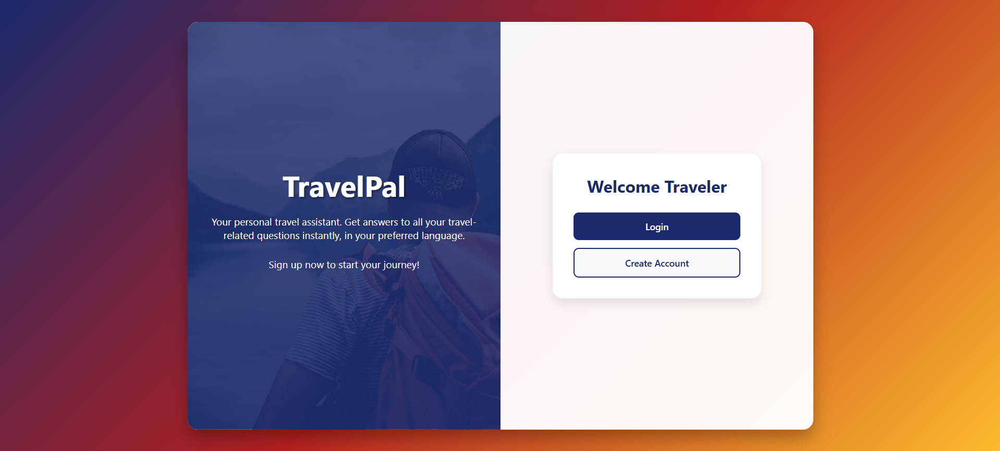
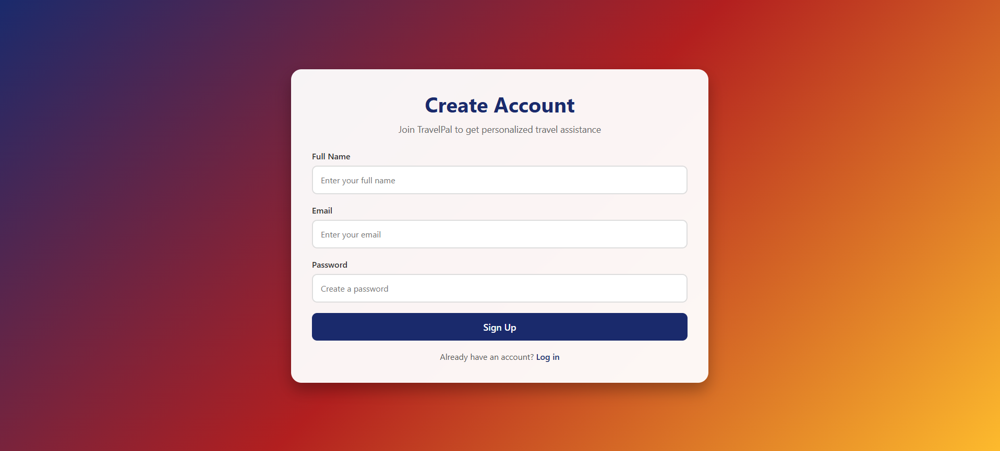

# Travel-FAQ-Bot

This project is a FAQ Bot, that can answer all travel related queries

I have used Python 3 for this repository. The packages required for this project are mentioned in requirements.txt

 

- To install the packages use:

```bash
pip install -r requirements.txt
```

- Download or clone the repository

```bash
git clone https://github.com/aaradhy25tiwari/Titanic-Dataset-Chat-Agent.git
```

## Interface

Introduction Page


Login Page


Sign-Up Page


Bot Usage


## Happy Coding! 🖥️
